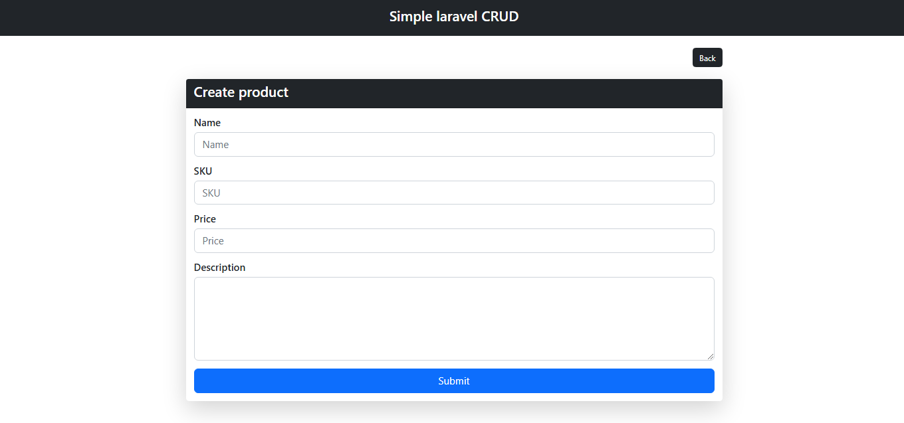
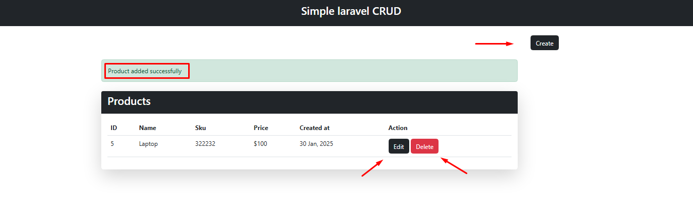
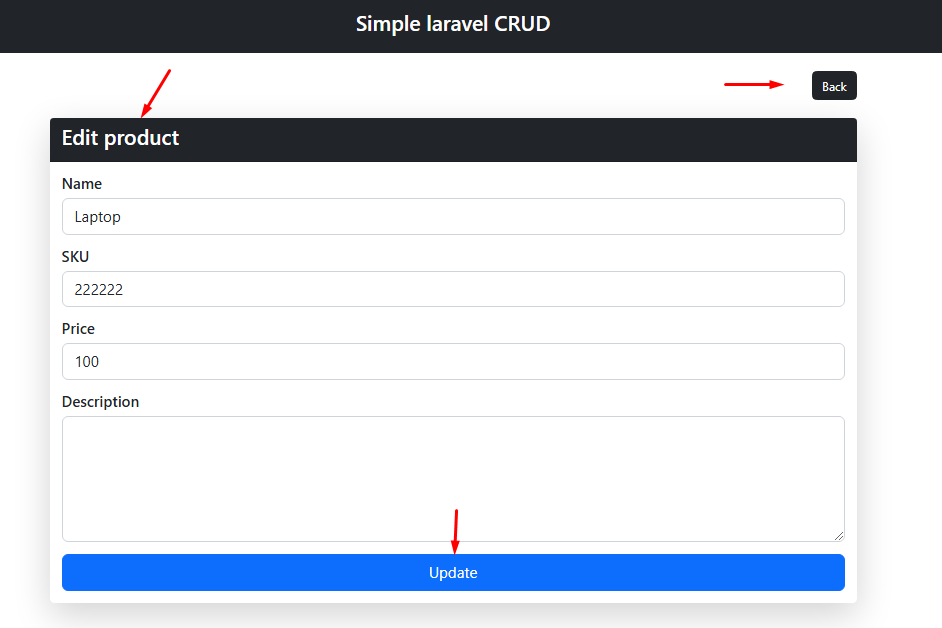
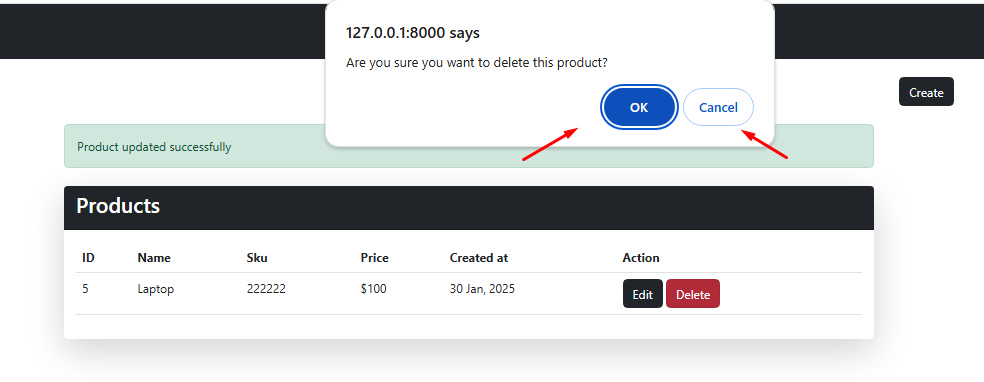

## Simple Laravel CRUD App
This is a basic Laravel CRUD (Create, Read, Update, Delete) application for managing products. Users can add, edit, delete, and view products.

## Features:
- ✅ Add new products (name, SKU, price)
- ✅ View all products in a table
- ✅ Edit product details
- ✅ Delete products with confirmation

## Technologies Used:
- ✅ Laravel 
- ✅ Blade 
- ✅ Bootstrap 
- ✅ MySQL 
- ✅ JavaScript

## 📸 Screenshot
Here is some moments of the project.

